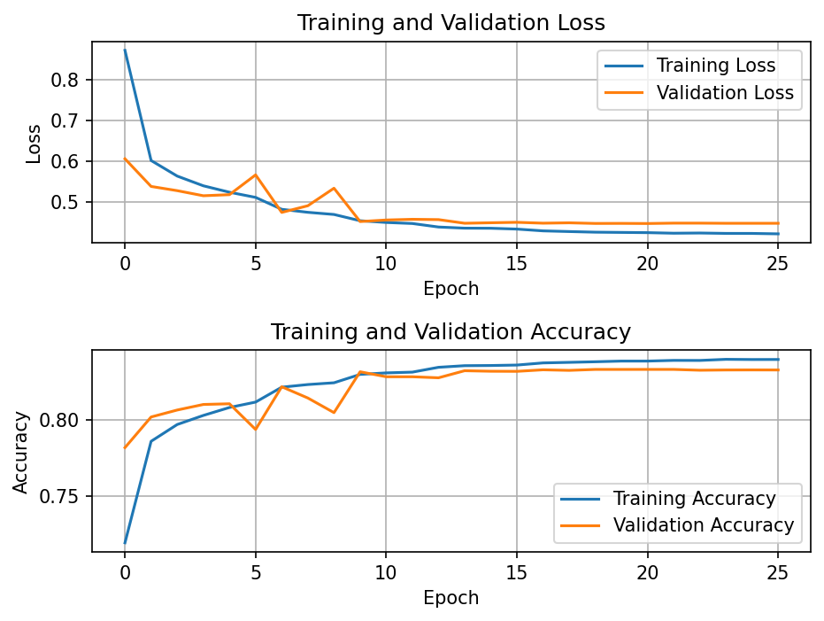
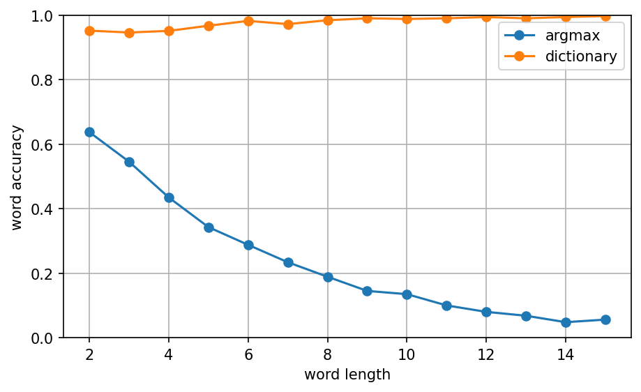

# Results

Experiment log for the character-level CNN and the word-level reading pipeline.

Each configuration was trained once, so the spread across repeated runs is not
measured — differences of a few tenths of a percentage point should not be
over-interpreted.

## Experiments

| # | Change                                                 | val_acc | Epochs | Params |
|---|--------------------------------------------------------|---------|---|---|
| 1 | Baseline: 2 conv blocks, dense 128, dropout 0.5        | 81.6%   | 14 | 555k |
| 2 | + 3rd conv block, dense 256                            | 83.0%   | 12 | 640k |
| 3 | + BatchNorm, dropout 0.5 → 0.3                         | 83.2%   | 11 | 642k |
| 4 | + offline rotation augmentation (±10°)                 | 83.4%   | 10 | 642k |
| 5 | GlobalAveragePooling2D instead of Flatten, dropout 0.5 | 83.3%   | 26 | **150k** |
| 6 | #5 without augmentation (ablation)                     | 82.7%   | 29 | 150k |

**Model #5 is the final model.** The column above is validation accuracy, which
is what selection used — #4 scores 0.1 p.p. higher, inside the noise, and #5
reaches the same place with a quarter of the parameters. The test set was
evaluated once, on #5 only, and gives **83.36%** accuracy.

All configurations share the same loop: Adam, batch size 256, 50-epoch cap.
EarlyStopping on validation loss (patience 5) restores the best weights, and
ReduceLROnPlateau halves the learning rate after 2 epochs without improvement.
The Epochs column is where training stopped, not a fixed budget.

### Notes per experiment

**#1 → #2.** The baseline was underfitting: both curves plateaued after epoch 8,
and adding capacity produced the largest single gain in the series (+1.4 p.p.).

**#3.** BatchNorm + reduced dropout flipped the failure mode from
underfitting to overfitting — training accuracy pulled clearly ahead of
validation without improving the peak. Capacity had stopped being the
bottleneck.

**#4.** Offline rotation augmentation doubled the training set and moved
validation accuracy by 0.2 p.p. — nothing that survives the noise floor at this size;
#6 revisits this after the parameter reduction.
PHCD already contains natural slant variation across its writers, so synthetic
rotation adds little that is new — and it degrades what it copies: `cv2.warpAffine`
resamples with bilinear interpolation, so a rotated glyph has softer edges than the sharp original.
The model ends up training on a mixture of two distributions, one of which does not occur in real
handwriting. A confusion absent from the pre-augmentation runs appeared — `t` ↔ `+`, 233
errors combined in the final model ([table ignoring letter case](#most-frequent-confusions-ignoring-letter-case)), 
which is close to what a rotated `t` looks like.

Online augmentation via Keras `RandomRotation` layers was tried first and
abandoned — in TensorFlow 2.10 the underlying `ImageProjectiveTransformV3` op
runs on CPU, so every batch left the GPU and came back, and epochs went from
20 s to over an hour.

**#5.** `Flatten` → `Dense(256)` was 524k parameters — 82% of the entire
network — feeding on 4×4×128 = 2048 activations. Global average pooling
replaces it: instead of keeping all 16 values of each 4×4 feature map, it takes
their mean, leaving one number per channel — 128 in total.

The result: **77% fewer parameters at no cost in accuracy, and the overfitting
gap down to about a point** — training accuracy still runs slightly ahead, but
nothing like before. The run went 26 epochs before early stopping against 10–14
elsewhere; validation loss kept improving instead of turning over. Part of that
narrowing belongs to augmentation rather than pooling alone, as #6 shows. Those
half a million parameters were not carrying information; they were memorizing
the training set.

**#6.** Removing augmentation from #5 costs 0.6 p.p. and reopens the
train/validation gap to 2.9 p.p., against under 1 p.p. with it. The null result
in #4 was specific to the 642k-parameter model: with capacity to spare it
memorized the training set regardless, so more data changed nothing. At 150k
there is nothing to memorize with, and the extra data starts to count.
Augmentation stays in the final model.

*Model #5, training and validation curves:*



## Error analysis (model #5, test set)

Accuracy is reported twice: once over all 89 classes, and once with uppercase
and lowercase merged into single classes — most of the remaining errors turn out
to be case confusions, and the second number puts a figure on them.

| Metric | Value      |
|---|------------|
| Accuracy (89 classes) | **83.36%** |
| Accuracy ignoring letter case | **91.84%** |

### Most frequent confusions (all 89 classes)

| True → Predicted | Count | | True → Predicted | Count |
|---|---|---|---|---|
| O → 0 | 332 | | Ó → ó | 266 |
| p → P | 298 | | Ź → ź | 258 |
| 0 → O | 294 | | O → o | 254 |
| P → p | 288 | | ć → Ć | 244 |
| X → x | 278 | | Ż → ż | 243 |
| Ś → ś | 277 | | v → V | 242 |

Most of these are letters whose uppercase and lowercase glyphs are
near-identical in shape and differ mainly in size. Pairs that differ
in shape — `A/a`, `B/b`, `D/d`, `E/e` — do not appear at all; the model
separates those without trouble.

PHCD scales every glyph to a fixed 20 × 32 px box inside a 32 × 32 image and
centers it (documentation.pdf, ch. 6). The primary cue distinguishing
`c` from `C` is therefore removed during dataset preparation, before any model
sees it, and the 8.5 p.p. gap between 83.36% and 91.84% is what this classifier
loses to it.

`O → 0` and `0 → O` share that cause. Whatever separates a handwritten zero from
a capital O — usually proportions — does not survive the same rescaling, and
here the collision is three-way: `O`, `o` and `0` all compete. `O` is the worst
class in the model, with 62% of its test samples read as one of the other two.

### Most frequent confusions ignoring letter case

| True → Predicted | Count | | True → Predicted | Count |
|---|---|---|---|---|
| 0 → o | 439 | | l → i | 156 |
| o → 0 | 429 | | v → u | 143 |
| g → 9 | 204 | | t → + | 136 |
| z → 2 | 175 | | u → v | 128 |
| ł → t | 168 | | ź → ż | 104 |
| 2 → z | 161 | | + → t | 97 |

Merging case removes the `O`/`o` arm of the three-way collision above, but not
the other: `o` ↔ `0` is now the largest single error in the model at 868
combined. The rest falls into two groups — letters that are genuinely similar in handwriting
(`ł`/`t`, `i`/`l`, `u`/`v`) and further letter/digit collisions (`g`/`9`, `z`/`2`) — 
plus one diacritic pair (`ź`/`ż`).

## Word-level reading

### Method

Word images are composed of real PHCD glyphs: for each letter of a target
word, one random sample of that class is drawn **from the test split**, so the
model has never seen any of them. Up to 1000 words per length (all 127 words for
length 2), drawn from a Polish word list of 2 703 830 inflected forms. The list
contains no forms shorter than two or longer than fifteen characters, and uses
35 distinct characters — `a-z` plus the nine Polish diacritics.

Word-level results are reproducible run to run: the word list is sorted before grouping
(Python randomizes string hashing per process, so set iteration order otherwise
varies) and each length draws from its own RNG stream. Predictions are not
bit-exact — TF32 matrix multiplication on the GPU shifts about one word in a
thousand — so rows can move by a tenth of a point.

Three readings are compared:

- **argmax** — the highest-probability class at each position, independently
- **argmax, lowercased** — the same reading, lowercased to match the word list
- **dictionary** — the most likely dictionary word of the same length

The dictionary decoder performs lexicon-constrained maximum-likelihood
decoding: for a candidate word *w* of length *L*, the score is
`Σ log P(w[i] | position i)` and the highest-scoring candidate wins.
Positions are treated as independent, which makes the score a plain sum
over the per-position log-probabilities — computed for all candidates of
that length in a single vectorized lookup.

That scoring runs on the unmerged 89-class distribution. Summing each
uppercase class into its lowercase counterpart first — correct in
principle, since the word list is lowercase — was tried and rejected: it
cost 0.44 p.p. on average and 1.8 p.p. on four-letter words. Capital `I`
resembles lowercase `l`, so merging moves evidence that pointed at `l`
onto `i`, and `l → i` is already among the most frequent errors.

### Results



| Length | argmax | lowercased | dictionary | | Length | argmax | lowercased | dictionary |
|---|---|---|---|---|---|---|---|---|
| 2 | 63.8% | 76.4% | 96.1% | | 9 | 14.5% | 38.2% | 98.4% |
| 3 | 53.8% | 72.6% | 96.2% | | 10 | 13.1% | 34.4% | 98.6% |
| 4 | 42.4% | 63.5% | 95.2% | | 11 | 10.5% | 31.6% | 99.1% |
| 5 | 38.3% | 59.6% | 97.0% | | 12 | 8.8% | 27.4% | 99.1% |
| 6 | 29.9% | 54.8% | 97.5% | | 13 | 5.4% | 23.3% | 98.2% |
| 7 | 25.8% | 52.1% | 98.5% | | 14 | 5.9% | 23.8% | 99.4% |
| 8 | 19.1% | 43.0% | 98.9% | | 15 | 4.6% | 20.2% | 99.4% |

Lowercasing the argmax output is the fairer baseline, since the decoder only
ever produces lowercase: it raises mean accuracy across the fourteen lengths from 24.0% to 44.4%.
Roughly a quarter of the raw reading's failures were case errors the decoder never
has to make. The dictionary adds 53.6 p.p. on top of that, so the gap is not an
artifact of how the baseline was scored.

Raw per-character reading decays with length because errors compound: a
15-letter word needs all 15 characters right. At 83.36% per character, and
assuming independence, that predicts 6.6%; the measured 4.6% is lower, since
words draw only from the 35 lowercase classes rather than all 89.

Dictionary-constrained reading improves with length, because real words get
sparser. Every extra letter multiplies the number of possible sequences by 35,
while the number of real words never grows anywhere near that fast — 12× from
two letters to three, 1.6× from seven to eight, and past length 12 it declines
outright. At two letters, one possible sequence in ten is a real word, so a
single misread letter often lands on another valid one. At fifteen letters it is
one in $5.5 \times 10^{17}$, and the model would have to make several errors
that happen to spell a different word.


### When it works and when it does not

Long words tolerate several character errors:

```
magnetowidowemu -> argmax: ma9ne+owIdowemU -> dictionary: magnetowidowemu
```

Four wrong glyphs out of fifteen, still read correctly. Eleven matching letters
outweigh them, and no other Polish word fits better.

Short words fail when the misreading is itself a valid word:

```
mit   -> argmax: nit   -> dictionary: nit
cisem -> argmax: liSem -> dictionary: lisem
ho    -> argmax: hU    -> dictionary: hu
```

The constraint can reject non-words. It cannot choose between two real ones.

### Limitations

**Test words are drawn from the dictionary**, so the correct answer is always
among the candidates. These numbers are an upper bound: anything the word list
does not contain will be misread.

**Case is forced, not recovered.** The word list is lowercase only, so `Kość` is
read as `kość`. Correct for most words, wrong for proper nouns and
sentence-initial capitals.

**No sequence model.** The independence assumption above ignores the fact that
Polish orthography constrains letter sequences. The dictionary compensates
indirectly, since improbable sequences are not words — but nothing in the
scoring itself knows that `sz` is common and `sż` is not.

## Conclusion

The final model is three convolutional blocks (32, 64, 128 filters) with batch
normalization, global average pooling and a 256-unit dense layer — 150k
parameters, trained for 26 epochs on a rotation-augmented set. Across the
progression from #1 to #5, validation accuracy moved from 81.6% to 83.3%,
and 1.4 p.p. of that 1.7 came from the first change alone. The remaining three steps,
including a doubled training set and a 77% parameter reduction, left it flat — 
though #6 shows augmentation does start to matter once the parameters are gone.

Two limits are inherent to single-character classification on this dataset:

1. **Letter case** — 8.5 p.p. of the error is case alone (83.36% → 91.84% when
   uppercase and lowercase are merged); the size cue does not survive PHCD's
   fixed-box normalization.
2. **Letter/digit shape collisions** — `o` ↔ `0` alone accounts for 868 errors,
   and nothing at the character level can resolve them without context.

The word level handles them differently. Letter/digit collisions are resolved
outright: `0` appears in no Polish word, so `m0du` is read as `modu`. Case stops 
appearing in the output — the decoder only ever emits lowercase, so a
case error is impossible by construction. It is not free, though: a glyph read
confidently as `Ż` leaves little probability on `ż`, and that position scores
weakly. The word usually still wins on its other letters. Recovering that
discarded mass is exactly what the case-merging attempt above was for — and why
it looked worth trying.

The remaining headroom is in context, not in the classifier.

The natural next step is sequence modeling (CRNN + CTC) rather than further
tuning. CTC is segmentation-free by construction, which matters because
contour-based segmentation cannot separate joined cursive handwriting, and the
recurrent layers see context during recognition rather than after it. Whether
that beats the current pipeline on this data is untested.

## Environment

Python 3.10, TensorFlow 2.10.0, CUDA 11.2, cuDNN 8.1.0. Training uses `seed=42`.
Trained on an NVIDIA RTX 4050 Laptop GPU (~45 s/epoch with augmentation).